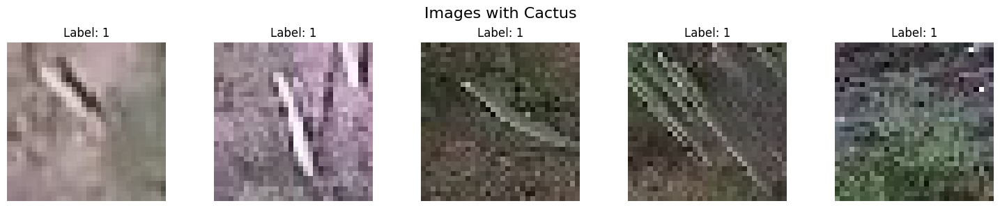
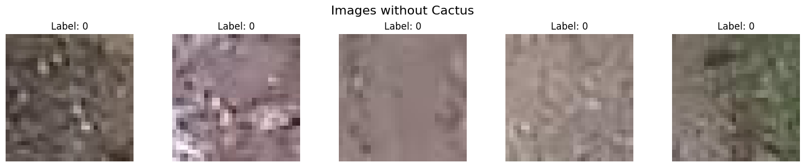
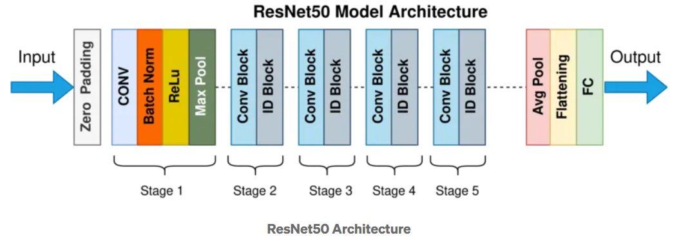
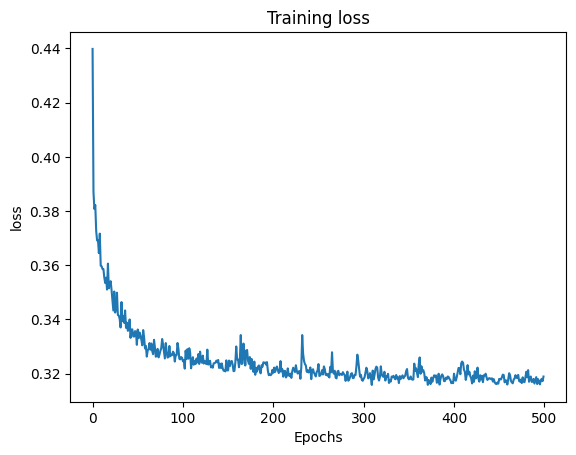
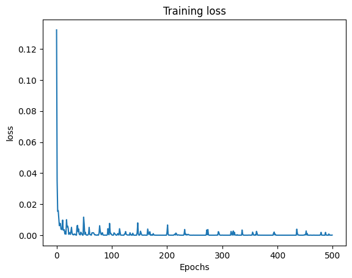

# AML Challenge 1: Cactus Binary Classification  
**Authors:** PAN Qizhi, KARIM Adnan  
**Date:** 11. May 2025  

---

## Introduction

In this challenge, we tackle a binary classification task involving 32×32-pixel aerial images to determine the presence of a specific cactus species. Our approach divides the problem into two stages:

1. **Feature extraction** using convolutional neural networks (CNNs).  
2. **Binary classification** trained on the extracted features.

For feature extraction, we first adopt **ResNet-50**, a widely used CNN with residual connections, as our benchmark model. While ResNet-50 excels in many image recognition tasks, we hypothesize its deep architecture (50 layers) may struggle with small input sizes, potentially losing fine-grained spatial details critical for identifying subtle cactus patterns.

To address this limitation, we test **EfficientNet**, a modern architecture designed for parameter efficiency and scalability. Its compound scaling mechanism balances depth, width, and resolution, making it better suited for low-resolution images like our 32×32 inputs.

To fairly compare the feature extraction capabilities of ResNet-50 and EfficientNet, we keep the downstream classifier identical (sigmoid) for both models, ensuring performance differences reflect only the quality of the extracted features.

---

## Data Analysis and Preprocessing

For this task, we use all the images located in the `./train` directory as our dataset. The dataset contains a total of 17 500 images:

- **13 136** labeled as `1` (containing cactus)  
- **4 364** labeled as `0` (no cactus)  

This indicates a class imbalance toward cactus-containing images.

### Analysis

We begin by visually inspecting sample images from both classes:

  
*Figure: Example of an image containing a cactus.*

  
*Figure: Example of an image without a cactus.*

From the visual comparison, we observe that images labeled as containing cactus often exhibit:

- More linear textures (corresponding to the shape and structure of cactus)  
- Greater presence of green hues, likely due to vegetation  

These visual cues suggest that the key discriminative features for our neural network should include the ability to detect fine textures and color distribution patterns associated with vegetation.

### Preprocessing

1. **Train/Val/Test split**:  
   - 70 % training  
   - 15 % validation  
   - 15 % test  
   Stratified sampling was used to preserve class balance. Files were reorganized into subfolders by label (`0` or `1`) for compatibility with `ImageFolder`.

2. **Transforms**:  
   - Converted images to tensors with `ToTensor()`.  
   - Computed dataset-wide channel means and standard deviations for normalization:  
     - Mean: `[R_mean, G_mean, B_mean]`  
     - Std:  `[R_std,  G_std,  B_std]`  

---
## Class Imbalance Handling

To address class imbalance in the dataset, we employed a **weighted cross-entropy loss** function. Class weights were computed based on the inverse frequency of each class in the training set, assigning higher weight to the minority class to ensure fairer learning.

### Computing Class Weights

We computed the weights as the inverse frequency of each class:

| Class         | Frequency (train) | Weight (inverse freq) |
|---------------|-------------------|-----------------------|
| **0 (majority)** |       _n₀_         | 0.2494                |
| **1 (minority)** |       _n₁_         | 0.7506                |

These weights were then converted to a PyTorch tensor and passed to the `CrossEntropyLoss` criterion.

### PyTorch Implementation

```python
import torch
import torch.nn as nn

# Example class weights
class_weights = torch.tensor([0.2494, 0.7506], dtype=torch.float)

# Move to GPU if available
if torch.cuda.is_available():
    class_weights = class_weights.cuda()

# Define the loss criterion
criterion = nn.CrossEntropyLoss(weight=class_weights)

# In your training loop:
# outputs = model(inputs)
# loss = criterion(outputs, targets)
# loss.backward()
# optimizer.step()
```
## Benchmark Model and Performance

### ResNet-50

We used a pretrained ResNet-50 model from `torchvision.models` as a base. All convolutional layers were frozen to leverage pretrained features. The final fully connected layers were replaced with a custom classifier head designed to introduce non-linearity while progressively reducing feature dimensionality to a binary output.

  
*Figure: Architecture of the ResNet-50 residual neural network.*

#### Training Details

- **Epochs:** 500  
- **Learning rate:** 0.0005  

  
*Figure: Training loss of ResNet-50.*

#### Confusion Matrix

|              | **Pred: 0** | **Pred: 1** |
|--------------|------------:|------------:|
| **True: 0**  |        1 924 |          41 |
| **True: 1**  |          46 |         614 |

#### Metrics

| Metric             | Value   |
|--------------------|--------:|
| AUC score          | 95.7 %  |
| Accuracy           | 96.7 %  |
| F1 score           | 93.4 %   |
| Precision          | 93.0 %   |
| Recall             | 93.7 %   |

Although ResNet-50 performs well (96.7 % accuracy, 93.4 % F1), these results must be considered alongside class imbalance. F1, precision, and recall provide more meaningful insights than accuracy alone. The model performs reliably, but with some misclassifications.

**Observation:**  
The model required significant training time and epochs to stabilize, as shown in its loss curve. This slow convergence and moderate misclassification rate suggest that ResNet-50 is not ideally suited for low-resolution image tasks under resource constraints.

---

## Improved Method

### EfficientNet-B0

To cope with the problems that ResNet-50 might have, we employed **EfficientNet-B0**, a lightweight CNN with approximately 5.3 M parameters and 0.39 B FLOPs. In comparison:

- **ResNet-50**: 25.6 M parameters, 4.1 B FLOPs  
- **EfficientNet-B0**: ~5× fewer parameters, ~10× fewer FLOPs  

| Model              | Parameters | FLOPs      |
|--------------------|-----------:|-----------:|
| ResNet-50          |     25.6 M |    4.1 B   |
| EfficientNet-B0    |      5.3 M |    0.39 B  |

#### Training Details

- **Epochs:** 500  
- **Learning rate:** 0.0005  

  
*Figure: Training loss of EfficientNet-B0.*

##### Confusion Matrix

|              | **Pred: 0** | **Pred: 1** |
|--------------|------------:|------------:|
| **True: 0**  |        1 961 |           0 |
| **True: 1**  |           9 |         655 |

##### Metrics

| Metric             | Value   |
|--------------------|--------:|
| AUC score          | 99.8 %  |
| Accuracy           | 99.6 %  |
| F1 score           | 99.3 %   |
| Precision          | 98.6 %   |
| Recall             | 100 %    |

**Comparison:**  
EfficientNet-B0 outperforms ResNet-50 in predictive capability and training dynamics. It achieves 99.6 % accuracy, 99.8 % AUC, and converges more smoothly and rapidly, with near-zero loss through most of training.

---

## Conclusion

The superior performance of EfficientNet-B0 over ResNet-50 in this classification task can be largely attributed to its refined architectural design:

- **Compound scaling** balances depth, width, and resolution.  
- **Depthwise separable convolutions** and **squeeze-and-excitation** blocks enhance feature extraction.  
- Achieves better representation with fewer parameters, leading to improved generalization and faster convergence.

In summary, EfficientNet-B0’s design allows for deeper semantic understanding and more effective use of spatial hierarchies, making it the superior choice for low-resolution image classification tasks where both accuracy and computational efficiency are essential.

---
